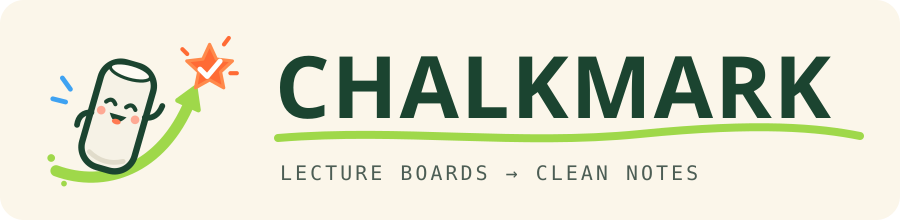

<p align="center">
  
</p>

<p align="center">
  <b>The board forgets. Your notes don't.</b><br />
  Point any camera at the board. Chalkmark looks straight through the lecturer, saves every board the moment before it's erased,<br />
  and Gemini turns the ink — equations, graphs, trees, code, even a sketch of a car — into a clean, printable study sheet.
</p>

<p align="center">
  <a href="https://chalkmark-513544387119.us-central1.run.app"></a>
  
  
  
  
</p>

<p align="center">
  <a href="https://chalkmark-513544387119.us-central1.run.app"><b>Live app</b></a> ·
  <a href="#how-it-works">How it works</a> ·
  <a href="#command-line">CLI</a> ·
  <a href="#results">Results</a> ·
  <a href="#responsible-ai">Responsible AI</a> ·
  <a href="#run-it">Run it</a>
</p>

---

## Why

At SF State, plenty of students can't actually read the board: a bad seat in a 200-person lecture hall, low vision, a pillar, a lecturer standing in front of the derivation, or English as a second language and no time to copy *and* listen. Boards get erased in seconds. Recordings exist, but nobody rewatches 75 minutes to find one line.

**Chalkmark** turns a phone on a desk, a webcam, a lecture recording or a YouTube link into exactly what the board said — cleaned, typeset and condensed into a one-to-two page study sheet you can print.

**Who benefits at SFSU:** students with low vision or seats far from the board, students using DPRC accommodations who are given recordings, multilingual students, anyone who missed class — and instructors, who can publish clean board notes without retyping them.

## How it works

Chalkmark does **not** stream a video to a model. A small, deterministic vision engine runs on your device and decides which few images are worth sending.

```
camera / recording ──► board engine (on device) ──► saved boards ──► Gemini ──► code checks ──► study sheet + PDF
                        f₁–f₅: no AI, no upload      drafts dropped    read      math, dedupe     US Letter / A4
```

**On your device — no AI**

1. **Frames, not video.** The recording is decoded in the browser with WebCodecs in one forward pass (~1 frame/s). The file never leaves the device.
2. **Flatten the board, model the light.** Homography → a grid of ~550 cells. Board brightness is fitted as a quadratic surface with the lecturer trimmed out as an outlier, so ink is contrast against the board behind it, not a global threshold.
3. **Look through the lecturer.** A cell enters memory only if it has been still ≥ 1.2 s, looks like board, and neither it nor a neighbour is a person (MediaPipe segmentation + the engine's own occlusion rules):
   `T(c) = [still ≥ 1.2 s] · [board ≥ 0.55] · ∏ₙ∈N₈(c) (1 − personₙ)`
4. **Save the board before it's erased.** When remembered ink starts disappearing and it was never saved, the board is captured the instant before it's gone: `save ⇔ Σ unsaved(c)·|ink_c| ≥ 48 px` over cells losing ink. Camera pans are detected from 1-D ink profiles and handled the same way.
5. **Drop the drafts.** A board whose ink is ≥ 86 % contained in a later board (after shift alignment) is a draft and is never sent.

**Gemini on Google Cloud — then checked in code**

6. **Gemini reads each board** — the clean render, the raw photo and the speech around it — into typed blocks (text, LaTeX, tables, graphs, diagrams, code) with positions. *When* each block was written is measured from the ink, not guessed.
7. **Clean up in code, not on trust.** Duplicates are merged only when code confirms the twin exists; blurry `[?]` copies match their sharp twin; a smeared photo keeps only what's readable.
8. **Redraw figures, then check the math.** Graphs become exact vector plots; lines and vectors are parsed back and **snapped to the equations written on the board**. Data structures (arrays, linked lists, stacks, queues, trees/BSTs, graphs, hash tables) are described as data and laid out by code.
9. **A study sheet, not a transcript.** One or two real US Letter / A4 pages in two columns, with the lecture's own worked example — on screen, in print and as a PDF, identical.

## Features

- **Recorded video, live camera or a YouTube link** · Quick scan for a first look in about a minute
- **Lecturer removal** with a live view of what the engine trusts, and a live **ink-over-time chart** of every save
- **Subjects:** Auto · Math & science · **Data structures** (structure redraws + code blocks + Big-O in the sheet)
- **Exact figures:** vector redraws checked against the board's own equations; the original ink is always one click away
- **Real pages:** PDF rendered by headless Chrome from the same components — typeset math, vector figures, page numbers
- **Markdown export**, shareable links (Firestore + Cloud Storage), and a **command-line tool**

## Command line

The same board engine runs in your terminal. ffmpeg decodes the video locally; only the saved board images go to a Chalkmark server (the public one by default, so no API key is needed).

```bash
npm install && npm link            # puts `chalkmark` on your PATH
chalkmark scan lecture.mp4         # engine → boards → Gemini → notes.md + study-sheet.md
chalkmark board whiteboard.jpg     # notes from photos of a board
chalkmark youtube https://www.youtube.com/watch?v=…
```

Options: `--subject cs|math`, `--quick`, `--dry` (engine only, no AI), `--no-sheet`, `-o <dir>`, `--server <url>`. A 16-minute lecture scans in ~10 s and becomes notes in under a minute.

## Results

Measured on MIT 18.06SC recitation *"Geometry of Linear Algebra"* (16:35, panning camera, chalkboard, 640×360) against a hand-made answer key (`npm run eval`):

| | |
|---|---|
| Board items captured | **14 / 15** (all 6 core items) |
| Figures passing the math check | **2 / 2** |
| Vision tokens vs. sending the whole video at the same detail | **13× fewer** (19,809 vs 267,951 — Gemini `countTokens`) |
| Upload | **403 KB** of board images vs a **24 MB** video (**60×** smaller) |
| Frames → boards read | 1,200 frames → 21 snapshots → **9 boards** |

## Models and open weights

| Model | Where | Role | License / terms |
|---|---|---|---|
| **Gemini 3.1 Pro** (`gemini-3.1-pro-preview`) | Vertex AI | reading boards, redrawing figures | [Google Cloud terms](https://cloud.google.com/terms) |
| **Gemini 3.8 Flash** (`gemini-3.8-flash`) | Vertex AI | notes, study sheet, transcription, fallback | [Google Cloud terms](https://cloud.google.com/terms) |
| **Gemma 4** (`gemma-4-26b-a4b-it`, fallback `gemma-4-31b-it`) | Gemini API | instant board titles during live capture (`lib/ai/models.ts`, `app/api/board/caption`) | open weights · [Gemma Terms of Use](https://ai.google.dev/gemma/terms) |
| **MediaPipe Selfie Segmenter** | on device (WASM) | person mask so the lecturer never enters board memory | [Apache-2.0](https://github.com/google-ai-edge/mediapipe/blob/master/LICENSE) |

Every model call goes through one chain (`withModels`) that tries the strongest model first and falls through on quota, timeout or malformed output — a busy model never ends a demo.

## Google Cloud

| Service | Role |
|---|---|
| **Vertex AI** (Gemini) | board reading, redraws, notes, transcription |
| **Gemini API** (Gemma 4, YouTube) | open-weight titles; YouTube links |
| **Cloud Run** | hosts the app (+ headless Chromium for PDFs) |
| **Firestore** | saved notes |
| **Cloud Storage** | board images and figure crops — never video |
| **Secret Manager** | the Gemini API key |
| **Cloud Build / Artifact Registry** | `scripts/deploy-cloud-run.sh` |

## Responsible AI

- **Privacy by design.** Video is processed on the device; only cropped board images (and, if enabled, compressed speech) are sent. Faces are never sent on purpose: the lecturer is removed before the board is read.
- **No silent guessing.** Unreadable writing is marked `[?]` and shown next to the original ink; low-legibility boards keep only what is clear; every redrawn figure has a "compare with the board" view.
- **Checked, not trusted.** Figure coordinates are snapped to the board's own equations; duplicates are merged only when code confirms them; the number of worked examples comes from the board, not the model.
- **Accessibility.** Typeset text and math are screen-reader friendly and printable at any size; reduced-motion settings are respected.
- **Limits.** Very glossy boards, extreme angles and dense handwriting reduce accuracy; notes are a study aid and should be checked against the lecture. Recording a class requires the instructor's permission and SFSU policy.

## Run it

```bash
npm install
cp .env.example .env.local        # GOOGLE_GENERATIVE_AI_API_KEY=…  (or GOOGLE_VERTEX_PROJECT=… with gcloud ADC)
npm run dev                       # http://localhost:3000
npm test                          # board engine, notes, figure checks
npm run eval                      # score saved notes against an answer key
```

Deploy to Cloud Run (enables the APIs, creates Firestore, the bucket and a service account):

```bash
PROJECT=your-project ./scripts/deploy-cloud-run.sh
```

## Project structure

```
lib/board/        board engine: homography, lighting model, trust test, snapshots, paper render, supersede
lib/notes/        schemas, dedupe, figure specs + math check, data structures, study sheet, export
lib/ai/           model chain (Gemini on Vertex / Gemini API, Gemma 4)
app/api/          read · redraw · compose · sheet · transcribe · youtube · pdf · lectures
components/       studio, notes, paged study sheet, figures, landing
cli/              the `chalkmark` command
evals/            answer keys
```

## Hackathon tracks

Built at **SF Hacks × GDG AI Hackathon 2026** (San Francisco State University).

- **GDG — Build with AI for Social Good:** Gemini reads, redraws and condenses the board; Vertex AI, Cloud Run, Firestore, Cloud Storage and Secret Manager on the provided credits.
- **Build for SFSU:** accessible board notes for SF State students; responsible-AI section above.
- **MLH — Best Open-Source AI Project / Best Use of Gemma 4:** MIT-licensed, Gemma 4 via the Gemini API, named above with its terms.

## License

[MIT](LICENSE) © 2026 Akmal Shavkatov · [GitHub](https://github.com/Akmalchan)
